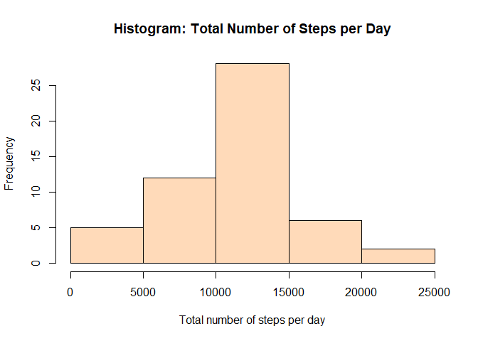
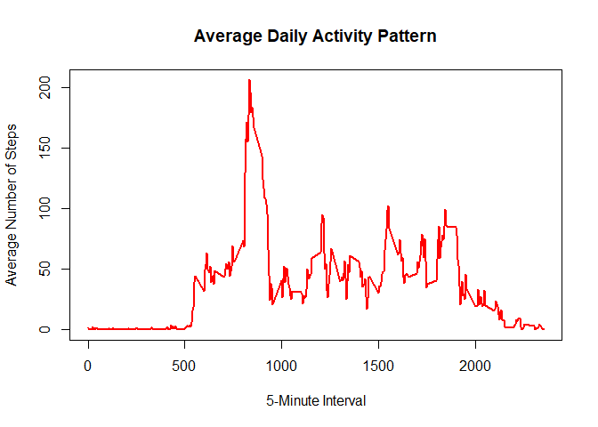
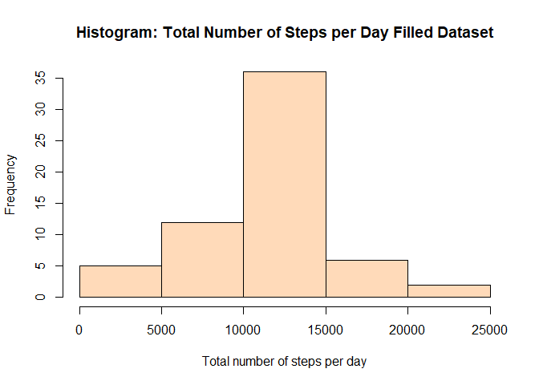
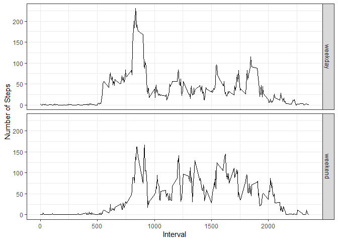

## Loading and preprocessing the data

```r
mytable <- read.table("activity.csv", header = TRUE, sep = ",", stringsAsFactors = TRUE)
```

Here is a summary table

```r
library(knitr)
kable(summary(mytable))
```


|   |    steps      |        date     |   interval    |
|:--|:--------------|:----------------|:--------------|
|   |Min.   :  0.00 |2012-10-01:  288 |Min.   :   0.0 |
|   |1st Qu.:  0.00 |2012-10-02:  288 |1st Qu.: 588.8 |
|   |Median :  0.00 |2012-10-03:  288 |Median :1177.5 |
|   |Mean   : 37.38 |2012-10-04:  288 |Mean   :1177.5 |
|   |3rd Qu.: 12.00 |2012-10-05:  288 |3rd Qu.:1766.2 |
|   |Max.   :806.00 |2012-10-06:  288 |Max.   :2355.0 |
|   |NA's   :2304   |(Other)   :15840 |NA             |


## What is mean total number of steps taken per day?
I create a new dataframe variable called nonna without NA's. Here is a summary table


```r
nonna<-na.omit(mytable)
kable(summary(nonna))
```


|   |    steps      |        date     |   interval    |
|:--|:--------------|:----------------|:--------------|
|   |Min.   :  0.00 |2012-10-02:  288 |Min.   :   0.0 |
|   |1st Qu.:  0.00 |2012-10-03:  288 |1st Qu.: 588.8 |
|   |Median :  0.00 |2012-10-04:  288 |Median :1177.5 |
|   |Mean   : 37.38 |2012-10-05:  288 |Mean   :1177.5 |
|   |3rd Qu.: 12.00 |2012-10-06:  288 |3rd Qu.:1766.2 |
|   |Max.   :806.00 |2012-10-07:  288 |Max.   :2355.0 |
|   |NA             |(Other)   :13536 |NA             |

Using dplyr package I calculate the total number of steps per day.
Then a histogram is plotted


```r
library(dplyr)
```

```
## 
## Attaching package: 'dplyr'
```

```
## The following objects are masked from 'package:stats':
## 
##     filter, lag
```

```
## The following objects are masked from 'package:base':
## 
##     intersect, setdiff, setequal, union
```

```r
steps_day <- nonna %>% 
  group_by(date) %>% 
  summarise(total=sum(steps), .groups= 'drop')

hist(steps_day$total,
     col = "peachpuff",
     border = "black",
     xlab = "Total number of steps per day",
     main = "Histogram: Total Number of Steps per Day")
```

<!-- -->

The mean and median are very close.


```r
mymean <- mean(steps_day$total)
mymedian <- median(steps_day$total)
```

The mean of the total number of steps is 1.0766189\times 10^{4} and the median is 10765


## What is the average daily activity pattern?

Using dplyr package I calculate the mean of the number of steps taken.
Then a line chart is plotted


```r
steps_daily <- nonna %>% 
  group_by(interval) %>% 
  summarise(totalmean=mean(steps), .groups= 'drop')

plot(steps_daily$interval, steps_daily$totalmean, type = "l",
     col = 'red', lwd = 2,
     xlab = '5-Minute Interval', ylab = 'Average Number of Steps',
     main = 'Average Daily Activity Pattern')
```

<!-- -->


Get the maximum number of steps from the 5-minute interval, on average across all the days in the dataset.


```r
maxmean <- max(steps_daily$totalmean)
maxinterval <- steps_daily$interval[which.max(steps_daily$totalmean)]
```
The maximum average number of steps is 206.1698113 in the interval 835.


## Imputing missing values
Get the total number of missing values in the dataset

```r
count_nas <- sum(is.na(mytable))
```
The total number of missing values is 2304.

The imputation strategy chosen is the one based on the mean for that 5-minute interval


```r
meanvalues <-  nonna %>% 
  group_by(interval) %>% 
  summarise(totalmean=mean(steps), .groups= 'drop')
idx <- which(is.na(mytable))
cpytable <- mytable
for (i in 1:length(idx)){
    valueimputed<-meanvalues$totalmean[meanvalues$interval==cpytable$interval[idx[i]]]
    cpytable$steps[idx[i]] <-valueimputed
}
```


Here is a summary of the filled dataset

```r
kable(summary(cpytable))
```


|   |    steps      |        date     |   interval    |
|:--|:--------------|:----------------|:--------------|
|   |Min.   :  0.00 |2012-10-01:  288 |Min.   :   0.0 |
|   |1st Qu.:  0.00 |2012-10-02:  288 |1st Qu.: 588.8 |
|   |Median :  0.00 |2012-10-03:  288 |Median :1177.5 |
|   |Mean   : 37.38 |2012-10-04:  288 |Mean   :1177.5 |
|   |3rd Qu.: 27.00 |2012-10-05:  288 |3rd Qu.:1766.2 |
|   |Max.   :806.00 |2012-10-06:  288 |Max.   :2355.0 |
|   |NA             |(Other)   :15840 |NA             |

Here is the histogram from the filled dataset

```r
steps_filled <- cpytable %>% 
  group_by(date) %>% 
  summarise(total=sum(steps), .groups= 'drop')

hist(steps_filled$total,
     col = "peachpuff",
     border = "black",
     xlab = "Total number of steps per day",
     main = "Histogram: Total Number of Steps per Day Filled Dataset")
```

<!-- -->


```r
fillmymean <- mean(steps_filled$total)
fillmymedian <- median(steps_filled$total)
```

The mean and the median in the imputed dataset are the same 1.0766189\times 10^{4} and 1.0766189\times 10^{4}, respectively. Compared against the original dataset (no NA's), the mean are the same (Original (No NA's)=1.0766189\times 10^{4}, imputed = 1.0766189\times 10^{4}), but, the median is slightly different (Original (no NA's) = 10765, Imputed = 1.0766189\times 10^{4})


## Are there differences in activity patterns between weekdays and weekends?


```r
cpytable$day<-c("Sunday", "Monday", "Tuesday", "Wednesday", "Thursday","Friday", "Saturday")[as.POSIXlt(cpytable$date)$wday + 1]

cpytable$day[cpytable$day %in% c("Saturday", "Sunday")]<-"weekend"
cpytable$day[cpytable$day != "weekend"] <- "weekday"
wkd_table <- cpytable %>% filter(day == "weekday")
wknd_table <- cpytable %>% filter(day == "weekend")

cpytable <- aggregate(steps ~ interval + day, data=cpytable, mean)

library(lattice)
library(ggplot2)

ggplot(cpytable, aes(interval, steps)) + 
  geom_line() + 
  facet_grid(day ~ .) +
  xlab("Interval") + 
  ylab("Number of Steps")+theme_bw()
```

<!-- -->
